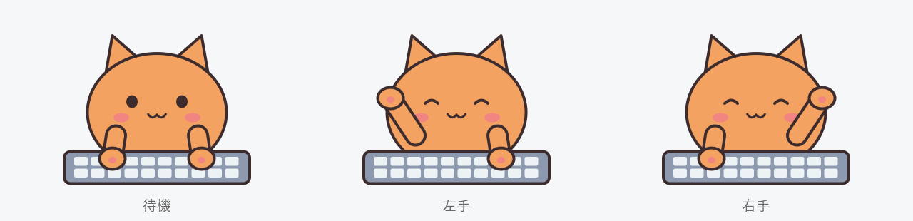

# MyTypingPet for Mac

キーを打つたびに、キャラクターが左右の手を交互に上げてぴょこっと跳ねる macOS 用デスクトップペットです。



[MyTypingPet](https://github.com/so-kid/MyTypingPet-win) の macOS 版です。[swoonqx/TypingPet](https://github.com/swoonqx/TypingPet) から着想を得た、独立したプロジェクトです (本家とは関係ありません)。

## 主な機能

- どのアプリで入力しても反応する (システム全体のキー入力を検知)
- 待機・左手・右手の画像を好きなものに差し替え (PNG / JPG / GIF / BMP)
- **パターン** — 特定の入力で別の画像を表示 (最大 10 個)
  - 修飾キー + 特定のキー (例: `⌘ + S`, `F5`)
  - 修飾キー + 任意のキー (例: `⌘` を押しながら何かのキー)
  - 修飾キー単独 (例: `⇧ Shift` を押して離す)
  - マウスクリック (左 / 右 / 中 / サイドボタン、修飾キーとの組み合わせ可)
- **プリセット** — 画像とパターンの一式に名前を付けて保存し、切り替えられる (最大 10 個)
- サイズ 4 段階、常に最前面、位置ロック (クリック透過)、ログイン時の自動起動
- メニューバーに常駐。Dock と Cmd+Tab には出ない

## 動作環境

- macOS 13 以降、Apple Silicon 搭載の Mac
- ビルドする場合は Swift 6 (Xcode または Command Line Tools)

## ダウンロード

[Releases](https://github.com/so-kid/MyTypingPet-mac/releases/latest) から `MyTypingPet-mac-<バージョン>.zip` をダウンロードして展開し、`MyTypingPet.app` を「アプリケーション」フォルダへ移動します。

Apple の公証を受けていないため、初回は次の手順で開きます。

1. `MyTypingPet.app` を開くと、開けないという警告が出るので「完了」で閉じます。
2. 「システム設定 → プライバシーとセキュリティ」の下のほうに MyTypingPet についての表示が出るので、「このまま開く」を押します。
3. もう一度確認が出たら「このまま開く」を押します。

ダウンロードしたファイルの SHA-256 は Releases のページに載せています。

## ソースからビルドする

```bash
./scripts/create-signing-cert.sh   # 初回だけ
./scripts/build-app.sh
open build/MyTypingPet.app
```

`build/MyTypingPet.app` ができます。

- `create-signing-cert.sh` は、開発用のコード署名証明書「MyTypingPet Dev」をログインキーチェーンに作ります。この証明書で署名すると、ビルドし直しても入力監視の許可がそのまま残ります。証明書がない場合は ad-hoc 署名になります。
- `swift run` でも起動できます。その場合、入力監視の許可はターミナルアプリに対して求められます。
- ad-hoc 署名でビルドした場合は、ビルドし直すたびに入力監視の許可が外れます。そのときは一覧から MyTypingPet を削除 (−) してから、もう一度許可してください。
- `./scripts/release.sh` で配布用の zip を作れます。

## 入力監視の許可

どのアプリで入力しても反応するように、キー入力の検知には「入力監視」の許可が必要です。

1. 初回起動時に許可を求めるダイアログが出るので、「システム設定 → プライバシーとセキュリティ → 入力監視」で MyTypingPet をオンにします。
2. アプリの再起動を促すダイアログが出るので、再起動します。

## 使い方

起動すると画面右下にペットが現れます。ドラッグで好きな場所へ移動できます。

ペットを**右クリック**するか、メニューバーの肉球アイコンをクリックするとメニューが開きます。

| メニュー | 内容 |
|---|---|
| 画像を変更 | 待機 / 左手 / 右手の画像を選ぶ。「既定の絵に戻す」でネコに戻る |
| パターン | パターンの追加・キー変更・画像変更・削除 |
| パターンの表示時間 | 1 / 1.5 / 2 / 3 秒、または次の入力まで |
| プリセット | 画像とパターンの一式を保存・適用・上書き・名前変更・削除 |
| サイズ | 小 / 中 / 大 / 特大 |
| 常に最前面 | 他のウィンドウより手前に表示 |
| 位置ロック | クリックがペットを通り抜ける。解除はメニューバーのアイコンから |
| 位置リセット | 画面右下に戻す |
| ログイン時に起動 | ログイン時に自動で起動 |
| 終了 | アプリを終了 |

「ログイン時に起動」をオンにしたとき、「システム設定 → 一般 → ログイン項目」での許可を求められることがあります。

### 画像

- 推奨は **800 × 500 px の透過 PNG** です。
- 待機・左手・右手を同じキャンバスサイズ・同じ位置基準で作ると、切り替わりが自然になります。
- 表示サイズと縦横比は待機画像を基準に決まります。
- GIF はアニメーションせず、1 コマ目だけが表示されます。

### パターン

「パターン」→「パターンを追加...」でダイアログが開きます。登録したい入力を行い、続けて表示する画像を選びます。

| 登録したいもの | ダイアログでの操作 |
|---|---|
| `⌘ + S` など | そのまま押す |
| `⌘ + 任意のキー` | 「組み合わせるキーは何でもOK」にチェックして、`⌘` を押して離す |
| `⇧ Shift` 単独 | 押して、他のキーを押さずに離す |
| `⌃ + 右クリック` など | `⌃` を押しながら枠の中を右クリック |

- 1 つの入力に登録できるパターンは 1 つです。
- 特定のキーのパターンは「任意のキー」より優先されます。
- 修飾キーは完全一致で判定します (`⌘ + 任意のキー` は `⌘ + ⇧ + A` では発動しない)。左右の修飾キーは区別しません。
- マウスクリックは、パターンに登録したものだけに反応します。
- パターンの画像は「パターンの表示時間」で選んだ時間 (既定 1.5 秒) 表示されたあと、待機の画像に戻ります。表示中に別のキーを押すと、すぐに通常の動きに戻ります。

### プリセット

「プリセット」→「現在の設定を保存...」で、待機・左手・右手の画像とパターンの一式を名前付きで保存できます (最大 10 個、名前は 16 文字まで)。サイズや位置などの表示設定は含みません。

保存したプリセットは、メニューから「適用」「今の設定で上書き」「名前を変更」「削除」ができます。

- 画像はプリセットごとに別フォルダへコピーして保存されるので、あとで画像を差し替えてもプリセットの中身は変わりません。
- 適用すると、今の画像とパターンはプリセットの内容に置き換わります。残しておきたい場合は先に保存してください。

## Windows 版との違い

- 修飾キーは、Windows 版の Ctrl / Shift / Alt / Win をそれぞれ control (⌃) / shift (⇧) / option (⌥) / command (⌘) に置き換えています。
- ゲームパッド (DualSense / DualShock 4) には対応していません。
- 設定ファイルの形式が異なるため、Windows 版の設定やプリセットは読み込めません。

## データの保存場所

設定と画像はすべて `~/Library/Application Support/MyTypingPet/` に保存されます。

| パス | 内容 |
|---|---|
| `settings.json` | 位置・サイズ・各種設定・パターン・プリセット |
| `images/` | 選んだ画像のコピー (元のファイルを移動・削除しても影響なし) |
| `images/presets/` | プリセットごとの画像のコピー |
| `error.log` | 問題が起きたときの記録 |

アンインストールするには、「ログイン時に起動」をオフにしてから、アプリとこのフォルダを削除してください。入力監視の一覧に残った MyTypingPet は「−」で削除できます。

## プライバシー

- キー入力は macOS の CGEventTap (listen-only) で「押されたこと」を受け取るだけで、入力を横取りしたり書き換えたりはしません。
- 押されたキー・ボタンの種類は、オートリピートの判定とパターンとの照合にだけ使い、**保存も送信もしません**。
- ネットワーク通信は一切行いません。

## ゲームと一緒に使うときの注意

MyTypingPet はゲームのプロセスに触れず (メモリの読み書き・コードの注入・入力の送信をしない)、入力を読むだけです。ただし、透明で最前面に表示される窓は外部オーバーレイ型のチートツールと見た目が似ているため、アンチチートの厳しいゲームでは問題になる可能性があります。

- ペットはゲーム画面に重ねず、別のモニターなどに置くことをおすすめします。
- 対戦ゲームなどでは、アプリを終了するか、「常に最前面」と「位置ロック」をオフにしてください。
- 外部ツールの利用については各ゲームの規約に従い、自己責任でお使いください。

## 既知の制約

- パスワード入力欄など、Secure Input が有効な間はキー入力を検知できません。

## ソース構成

| ファイル | 役割 |
|---|---|
| `AppDelegate.swift` | 起動処理、メニューバーアイコン、メニュー、パターン・プリセット管理、自動起動、入力監視の許可 |
| `PetWindow.swift` | 透明なペットウィンドウ、跳ねるアニメーション、パターン照合 |
| `InputMonitor.swift` | CGEventTap によるキーボード・マウスの検知 |
| `KeyTrigger.swift` | パターンの発動条件 (修飾キー + キー / 任意 / 単独 / クリック) とキーの表示名 |
| `TriggerDialog.swift` | 入力を実際に行ってパターンを登録するダイアログ |
| `DefaultArt.swift` | 既定のネコの絵をコードで描画 |
| `Preset.swift` | プリセットの保存・適用 (画像のコピーを含む) |
| `ImageFiles.swift` | Application Support にコピーした画像の置き場所と、安全な削除 |
| `NameDialog.swift` | プリセット名の入力ダイアログ |
| `Settings.swift` | 設定の読み書き |
| `Log.swift` | error.log への記録 |

| スクリプト | 役割 |
|---|---|
| `scripts/build-app.sh` | `build/MyTypingPet.app` を作って署名する |
| `scripts/create-signing-cert.sh` | 開発用のコード署名証明書を作る |
| `scripts/release.sh` | 配布用の zip を作り、SHA-256 を表示する |
| `scripts/make-icon.sh` | アプリのアイコン (`Resources/AppIcon.icns`) を既定の絵から作る |

## ライセンス

[MIT License](LICENSE)
